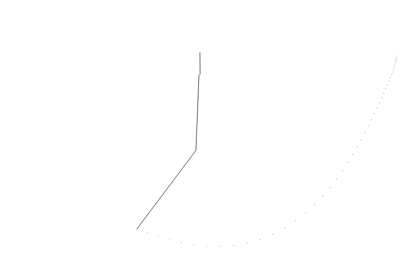

# Double pendulum
Uses 4th order runge kutta and the [equations of motion](https://en.wikipedia.org/wiki/Double_pendulum) for angular velocity and impulse to solve for the position of a double pendulum. No damping is in this system which is why it keeps moving.

